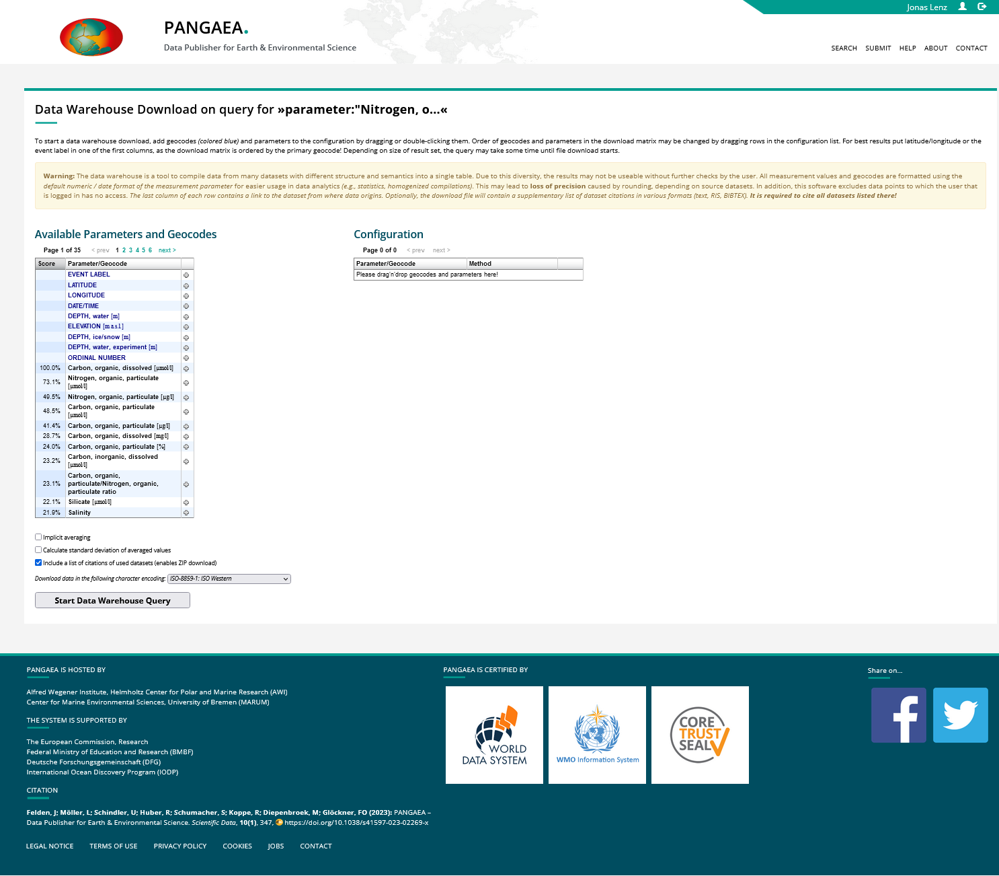

# Metadata query

"researches who measured your parameter, also measured ..."

Through the enriched metadata of datasets it becomes possible to do advanced metadata analysis.
E.g. to evaluate how often a parameter in the own experimental design is measured within other datasets, one can query all datasets with comparable parameter combinations, thus reflecting on the scientific relevance of the own experimental design.
The pangaea data warehouse allows for such a meta analysis by showing a high score for parameters, which are often recorded in combination with the queried parameters.
Such queries will become possible through SoilPulse across multiple data hosting repositories, with a growing number of metadata enriched datasets.

The [Pangaea Warehouse query](https://www.pangaea.de/?q=parameter%3A%22Nitrogen%2C+organic%2C+particulate%22+and+parameter%3A%22Carbon%2C+organic%2C+dissolved%22) for datasets including the parameters "Nitrogen, organic, particulate" and "Carbon, organic, dissolved" shows other parameters measured along with those two parameters.

